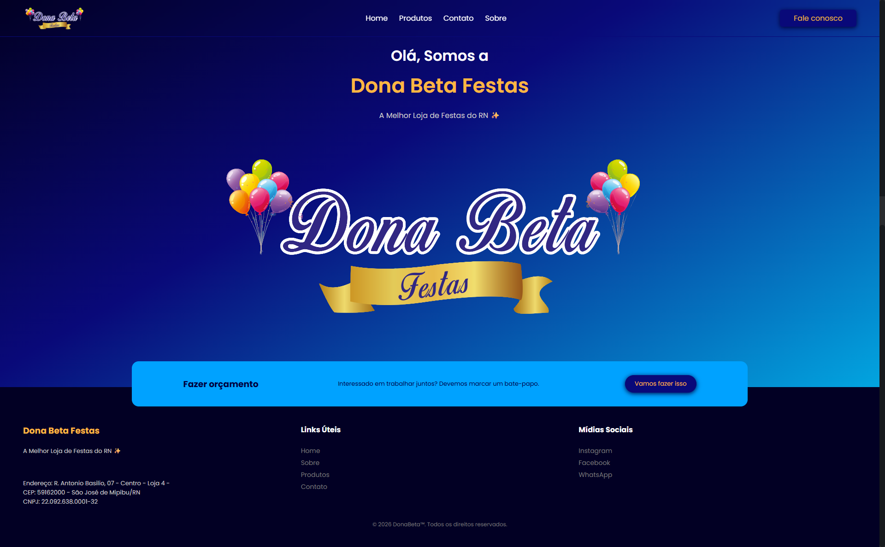

# 🎈 Dona Beta Festas - Site Institucional
Este é o repositório do site oficial da Dona Beta Festas, desenvolvido para apresentar o catálogo de decorações, serviços de pegue-e-monte e facilitar o contato de clientes para a reserva de eventos e festas temáticas.

# 🚀 Tecnologias Utilizadas
O projeto foi construído focando em uma experiência visual rica, performance e total responsividade para dispositivos móveis:

HTML5: Estrutura semântica para melhor SEO e acessibilidade.

CSS3: Estilização personalizada com foco em uma identidade visual festiva, utilizando Flexbox e Grid.

JavaScript (Vanilla): Lógica para navegação mobile, filtros de categorias de festas e animações de scroll.

Boxicons/FontAwesome: Ícones para redes sociais e diferenciais do serviço.

Google Fonts: Tipografia selecionada para transmitir alegria e profissionalismo.

# 📂 Estrutura do Projeto
O site é organizado de forma modular para facilitar a manutenção:

/: Página inicial (Home).

/about/: Informações detalhadas sobre a Dona Beta Festas.

/produtos/: Galeria dos meus principais produtos disponíveis.

/contato/: Informações de contato e endereço.

/assets/: Imagens, logos e recursos visuais.

# ✨ Funcionalidades
Galeria Interativa: Visualização detalhada dos kits de decoração.

Design Responsivo: Experiência otimizada, já que a maioria dos orçamentos é feita via dispositivos móveis.

Botão Flutuante de WhatsApp: Facilita a conversão imediata de visitantes em clientes.

SEO Local: Estruturado para ser encontrado por clientes que buscam decoração de festas na região.

# 🛠️ Como executar localmente
Clone este repositório:

Bash

git clone https://github.com/donabeta/donabeta.git
Navegue até a pasta do projeto.

Abra o arquivo index.html em seu navegador de preferência.

📧 Contato
Website Oficial: donabetafestas.com

Instagram: @donabetafestas

Desenvolvido por: BricioDev

© 2026 Dona Beta Festas. Todos os direitos reservados.

# Screenshot
Aqui está uma captura de tela do projeto:

